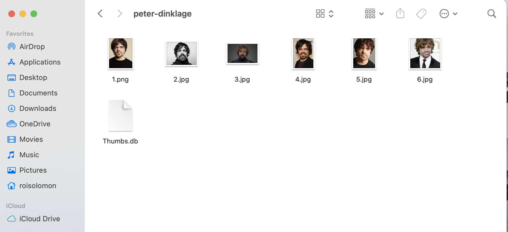

# Face Recognition
This project is my first try with Computer Vision. 
I used OpenCV in this project and also used HaarCasscade (Viola Jones Algorithm), and LBPH Algorithm.


### Requirements

  * Python 3.3+ or Python 2.7
  * macOS or Linux (Windows not officially supported, but might work)

To Begin, we have to provide folders that contains each character pictures, try to have at least 6 pictures for each person, we need to give the algorithm good amount of data. 





## Dependencies
Face-Recognition uses open-source libraries that we have to install first on our machine.
```bash
$ pip3 install opencv-python
$ pip3 install numpy
$ pip3 install dlib
$ pip3 install cmake
```
 
##### Adjust Sensitivity / Radius
Inside of our code you can see inside `faces.py` that we have a _function_ called `detectMultiScale()`, we have three values inside of it. The first one is the image in **grayscale**, then we have **ScaleFactor** for me it worked great with the value 1.1 I would suggest trying different values between 0.8~1.5. Last we have **minNeighbors**, good values will be in the range of 3~6.

## Articles and Guides about `LBPH Algorithm`
- [Face Recognition: Understanding LBPH Algorithm](https://towardsdatascience.com/face-recognition-how-lbph-works-90ec258c3d6b) by Kelvin Salton do Prado
- [Understanding Facial Recognition Using Local Binary Pattern Histogram (LBPH) Algorithm](https://www.section.io/engineering-education/understanding-facial-recognition-using-local-binary-pattern-histogram-algorithm/) by Ruth Mare

## Articles and Guides that cover `Haar-Cascades`

- [Face Detection with Haar Cascade](https://towardsdatascience.com/face-detection-with-haar-cascade-727f68dafd08) by Girija Shankar Behera
- [Haar Cascades, Explained](https://medium.com/analytics-vidhya/haar-cascades-explained-38210e57970d) by Aditya Mittal

